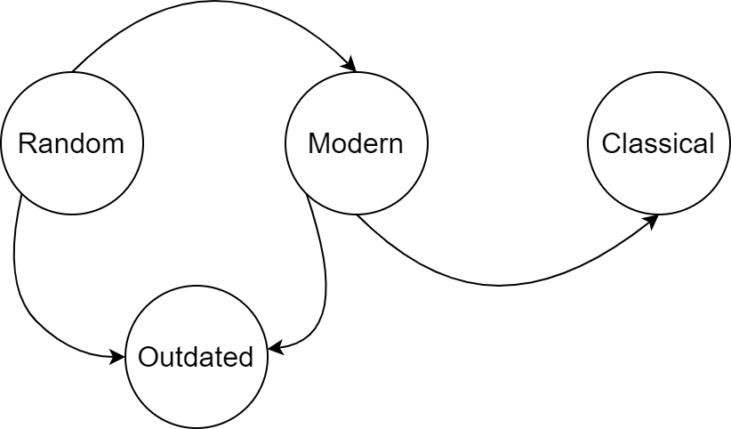
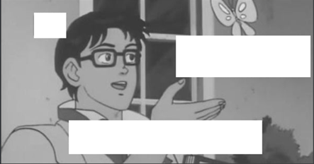
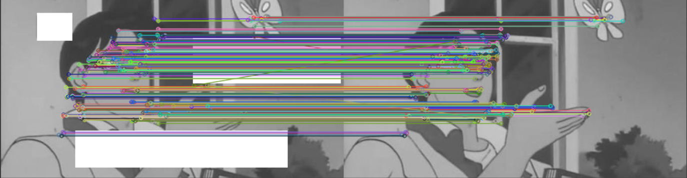
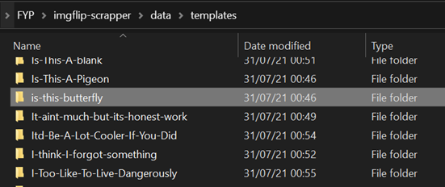

# Final Year Project
# _Meme Classification and Text Extraction_
**By Janas, Jaroslaw**

_Project Supervisor: Dr. Finlay Smith_

## Glossary
-	Meme – a media format composed of an image with superimposed text, generally used in a comedic setting.
-	Template (meme) – the image used to create a meme, usually used across multiple memes.
-	Media – means by which something is communicated.
-	Multimodality – “refers to the interplay between different representational modes, for instance, between images and written/spoken word” [1].
-	NN – a neural network.
-	CNN – convolutional neural network, a class of a neural network.
-	OCR – optical character recognition.
-	IDE – integrated development environment.

## Chapter 1: Introduction
### 1.1 Meme Definition
Memes are a rising medium in the current society but do not have a clear definition. Most content classified as memes consists of but is not limited to, a popular, recognisable image with superimposed text at the top, bottom or on both sides of an image.

While memes are a widely recognisable and accepted form of communication in many groups, there is no clear definition for this medium. However, a closer inspection revealed that memes could be split into four general categories:
-	Classics: these are the memes that are well established as formats and often consist of the same template (background image of a meme) and text that follows a specific design or pattern. Their usage usually spans an extended amount of time after their initial peak.
-	Modern: these are memes that gained popularity relatively quickly and are recognised by a subsection of the community. Their usage tends to slowly decrease over time after the initial rise.
-	Random: memes belonging to this group are composed of text overlaying any image, not necessarily a popular or recognisable one. The meaning of the resulting meme can be inferred from the combination of image and text but sometimes requires additional context to understand it fully.
-	Non-Image: this group encompasses any memes that do not use a static image as the background, for example, gifs or videos. Please note that this group can also be split into classical, modern, and random categories but primarily consists of content of the random variety.

Ignoring the non-image category, a simple lifecycle can be constructed, as shown in `Figure 1`. All memes start as random, and as they gain popularity, the concept and context behind the meme template solidify, pushing it to the modern category. If the template continues to be used throughout a more extended period, it becomes a widely recognised classic.



Also, note that a progression of a meme is not guaranteed and is solely dependent on its popularity and usage; for example, a meme can belong to the modern category and never progress any further. Furthermore, memes that fail to advance to the classical type will without fail see their usage rates drop and will become outdated.

### 1.2 Project Definition
The project aims to classify a meme as offensive or not, using the meme as an input. The resulting program should be able to do this in a reasonable amount of time and adjust to the changes in popularity of meme formats. The resulting program should extract necessary information from an image before attempting classification.

The project will not attempt to classify non-image or random memes.

### 1.3 Literature Review
By studying the following article on “Multimodal Meme Dataset (MultiOFF) for Identifying Offensive Content in Image and Text“ [2], a few key areas of interest and potential problems could be identified in advance.

#### Meme Multimodality
Memes are a multimodal form of communication; this means that the meaning of a medium depends on the resulting mix of all modalities. Even a single change in any of them can result in the alteration or even a complete inversion of the resulting meaning. In the case of this project, two modalities must be considered, the text and the image.

![Figure 2 [3]](https://drivendata-public-assets.s3.amazonaws.com/memes-overview.png)

`Figure 2` [3] showcases how changing one modality can negatively or positively affect the interpretation of a meme. By changing a single word from “love” (bottom left) to “hate” (bottom right), the meme’s meaning was changed from negative to positive. Of course, in pure text analysis, the word “hate” would be classified as hostile or offensive, but it had an opposite result in this scenario.

Despite multiple approaches and strategies to manually categorising how text and image influence the meaning of a meme as presented in “Multimodality in memes. A cyberpragmatic approach” [4], there is yet to emerge a way to do it efficiently using an algorithmic or machine learning approach.

It becomes clear that any classification model that attempts to classify memes accurately needs to consider both the text and the image in a way where the two are evaluated together rather than separately.

#### Dataset Availability
The article’s authors mention that “there was no publicly available dataset for multimodal offensive meme content detection” [2] which posed a real problem for this project. After a thorough search, very few datasets could be identified, of which none were suitable for this specific use case.

This problem significantly affected the design choices made in the early planning stages. It was decided that the best approach was to collect own data.

### 1.4 Potential Benefits
More communication is done by two parties sending each other memes that complement their text messages or even change their meanings altogether. Additionally, social platforms exist where sharing memes is the dominant way of communication. They are a visual medium that is notoriously difficult to extract meaningful data from, and thus moderation of offensive content must be done manually.

As it stands, the moderation of offensive content within memes must be carried out manually. This is due to several reasons, among them being both the sheer volume of memes and the need to consider the context. There exist social media platforms where the dominant means of communication is sharing memes, and the quantity of these memes makes moderation a daunting task.

The results of this project could prove beneficial to social platforms where the shared content is publicly available to a broader audience and must be strictly moderated. It could also be used in any scenario where memes are used as a form of communication, for example, a messaging app.

### 1.5 Potential Impact
No solution is perfect, including the results of this project or any other classification model. As is endemic with any automatic classification method, it is bound to produce false positives. In a scenario where a system is put in place to automatically moderate content sent by users on a social platform, every false positive occurrence will negatively affect the experience of the community with the platform.

It is recommended that such a system is never used independently but rather as an aid in identifying potentially insulting media to be manually reviewed. This eliminates the risk of false positives and significantly reduces the manual work required in moderation of a platform.

## Chapter 2: Technical Review
### 2.1 Design Choices
#### 2.1.1 Text Detection
While most memes follow a top-bottom approach, where the text is split into two sections located at the top and/or bottom of the image, there is nonetheless a significant number of those that do not follow this pattern.

The text and the template must be processed independently. The area in which text is located is a crucial piece of information required to extract the two modalities. Once the text area is identified, it can be cut out for subsequent pre-processing.

#### 2.1.2 Pre-processing and Optical character recognition (OCR)
The cut-out text must be adequately prepared before attempting any form of OCR, as the identified text area still has a background image and other noise that should be removed. A combination of blurring, thresholding, and dilation was determined to be the most suitable approach.

However, a particular problem was identified. Unfortunately, thresholding will produce different results from an image with a bright font and a picture with a dark font. The following assumption was made to solve this problem; a meme creator will not use a bright text on a bright background and vice-versa. After a quick analysis of a few hundred randomly chosen memes, it was found that none of the memes in the group went against this assumption. Following this assumption, the thresholding method can be sufficiently modified depending on the image to separate the text from the background correctly.

#### 2.1.3 Image Classification
One of the critical problems in classifying images is choosing the suitable classes – the output of a classifier. This is also heavily dependent on the type of dataset used for the classification process. Each classical and modern meme follows a designated pattern and has a unique template that can be reused when creating new memes. These templates are usually a single image used as a background for a new meme; these rarely diverge from the established norm. Following this observation, a set of memes can be grouped under a single template, where each template is a class of a meme that can be used as an output of the classification process.

The initial idea was to use some form of a neural network, such as a CNN, to classify images. However, the high number of possible outputs made this model incapable of training within a reasonable timeframe.

Instead, after general research, a feature extraction method was selected as a much more suitable option. This differs from the NN approach because it does not require any training, and a single image can be used as a reference to which the input is then mapped onto.

### 2.2 Dataset Collection
#### 2.2.1 Introduction
All datasets were collected for research purposed under the “fair dealing” concept and were and will not be made available for public use. “Fair dealing is defined in CRRA 2000 s50(4) as making use… for a purpose and to an extent which will not unreasonably prejudice the interests of the owner of the copyright” [5].

#### 2.2.2 General Meme Collection – 9gag
A scrapping program was developed to efficiently collect a sizeable dataset of unorganised memes from a popular platform called 9gag [6]. Each collected meme had the following information available: category, link, and tags. These tags were initially intended to be used for classification purposes. This dataset was later abandoned for a more pragmatical approach. 

#### 2.2.3 Structured Template Dataset – imgflip
Another web scrapping program was developed to collect meme templates used in the revised image classification process. Due to the design of the imgflip [7] website, the set of collected images is not fully exhaustive, and only around 1500 of the most popular templates were collected.
It saves the images into structured folders where each folder name corresponds with the template class. An additional effort had to be made to avoid collecting non-image templates such as gifs.

### 2.3 Technologies Used
#### 2.3.1 JavaScript
JavaScript is not a language most developers think of when making non-web-based software. However, it is one that I had already have a good understanding of. It proved extremely useful when developing programs for dataset web scraping and structuring the collected media.

#### 2.3.2 Selenium
Selenium [8] is a package that allows for browser automation. It has documentation that explains its functionality in detail and provides examples of it in various programming languages. Since Selenium interacts with the browser, a separate browser web driver needs to be downloaded to begin using this automation tool.

In this project, it was exclusively used for web scrapping of images, as mentioned in the Dataset Collection section (Chapter 2.2).

#### 2.3.3 Python
Python seemed like the most straightforward language within which the classification program could be developed. Due to its immense popularity and rise in recent years, most packages it uses are well documented. This documentation extends even further for any machine learning or deep-learning related work.

Python is an interpreted language that has a unique programming syntax.

#### 2.3.4 OpenCV
OpenCV is a library that heavily focuses on real-time computer vision. It consists of many features and is considered one of the go-to packages for any form of image or video manipulation or other related work.

It allows for reading in image files and implements necessary essential functions, thresholding and blurring being one of them, as well as more sophisticated neural network implementations and image feature extraction and matching.

The feature extraction algorithm used in this project is known as ORB; contrary to other algorithms available through OpenCV, SIFT and SURF, it is not patented and is entirely free to use. There are also additional benefits like increased speed and slightly improved performance compared to the alternatives.

#### 2.3.5 EAST Text Detection
EAST stands for “Efficient and Accuracy Scene Text detection pipeline” [9], it is a pre-trained deep learning model with “state-of-the-art text detection accuracy” [10]. 

#### 2.3.6 Tesseract OCR
Tesseract OCR is an open-source text recognition engine that Google initially developed. It is one of the most popular widely available OCR technologies available.

One of the main drawbacks of Tesseract is the amount of image pre-processing required for it to perform at the highest possible level. Multiple alternatives that showed much better accuracy were considered. However, the key deciding factor was availability, and out of those well-performing technologies, Tesseract was the only open-source one without any limitations regarding its usage.

#### 2.3.7 Visual Studio Code (VS Code)
It is an editor-like IDE developed by Microsoft. VS Code is an open-source platform with the ability to profoundly modify its settings and install plugins are a few of the characteristics that make it popular among developers.

In this project, it was used to develop all JavaScript programs.

#### 2.3.8 PyCharm
A popular IDE developed by JetBrains, famous for their other IDEs such as IntelliJ, allows for easy development and debugging of python code.

Thanks to this technology, debugging becomes much easier as the user can pause at any stage of the program and closely inspect variables. Its ability to integrate with other technologies such as Anaconda made it an ideal choice.

#### 2.3.9 Anaconda
A platform for Python that makes environment separation and management possible. It allows for the installation of packages in a specific environment and integrates well with the most popular IDEs.

#### 2.3.10 Git
Git is an open-source version control system that implements many different features revolving around version control, branches, merging etc. In this project, it was used for its ability to revert to previous versions of code and for incremental developments.

#### 2.3.11 PyYAML
A python package designed for interaction with YAML files was used as configuration/settings for the application.

## Chapter 3: Development
### 3.1 Introduction
An incremental development strategy was used – where a particular element must be at least function before the project can move forward. This was the optimal approach as each code section heavily depended on its predecessor.

### 3.2 General Architecture
The codebase architecture was split into four sections and one starting point. These sections are heavily based on the design choices (Chapter 2.1).

### 3.3 Config
A configuration file that included the necessary paths and settings required for the program’s operation was set up.

```yaml
tesseract:
  path: 'G:\FYP\Tesseract-OCR\tesseract.exe'

text_detection:
  confidence_threshold: 0.70
  nms_threshold: 0.8

data:
  templates:
    path: 'G:\FYP\imgflip-scrapper\data\templates\'
```

The tesseract path links the Tesseract OCR engine required for text recognition. The text detection settings are included here for easy configuration and testing. The last option is the path to meme templates which is necessary for the image classification section.

### 3.4 Entry Point - app.py
This is a file that runs the whole program and where the input images are loaded using OpenCV. It also loads the config file.

We can see all three main stages of the program listed here as the following functions: `text_detection()`, `text_recognition()` and `image_matching()`.

```python
input_img = cv2.imread(input_img_path)
bounding_boxes = text_detection(input_img, config)
text_recognition(bounding_boxes, input_img, config)
image_matching(input_img, bounding_boxes, templates, config)

```

The templates are imported using a python built in functionality `listdir()` which uses the path from the config to create a list of all folders in the template directory.

```python
templates = os.listdir(config['data']['templates']['path'])
template_paths = [config['data']['templates']['path'] + p + '\\' for p in templates]
```

We can see these templates used later in the `image_matching()` function.

### 3.5 Text Detection
This implementation is heavily based on the already existing solution found available on the internet [11] [12].

### 3.5.1 Pre-processing
The EAST detector requires the input image resolution in multiples of 32 pixels. A new image height and width are calculated, and the image is resized accordingly. This introduces a temporary stretching since each image axis is resized independently.

#### 3.5.2 EAST
Using OpenCV's `readNet()` function the detection model is loaded. The resized image is run through `dnn.blobFromImage()` function to prepare it for the network.

```python
# prepare image input - convert to 4D blob
img_blob = cv2.dnn.blobFromImage(image_resized, 1.0, new_dimensions, (0, 0, 0), True, False)
```

The image is not being rescaled, “1.0” scale is chosen, and there are no values subtracted from any of the colour channels “(0,0,0)”. Additionally, the boolean value for swapped red and blue channels is set to true; OpenCV imports images in a BGR format rather than RGB.
The resulting image data is forward propagated through the EAST network. The output of this function can be then decoded to obtain the bounding boxes (surrounding the detected text) and the confidence of the box having the text in it. The decoding function was copied from OpenCV’s repository [13].

#### 3.5.3 Non-Maximum Suppression – NMS
![Figure 3 [14]](https://miro.medium.com/max/1050/1*6d_D0ySg-kOvfrzIRwHIiA.png)

The resulting bounding boxes and their confidence are used as arguments in OpenCV's built-in NMS function, which attempts to merge and select the most promising results according to the confidence and NMS threshold values set in the config file. A very high value of NMS was used to avoid merging and deletion of overlapping bounding boxes to achieve better results in the bounding box merging stage.

| NMS Threshold   | Image |
| --------------- | ----- |
| Low NMS Threshold (0.2) | ![Figure 4 [15]](readme_images/figure_4.png) |
| High NMS Threshold (0.8) | ![Figure 5 [15]](readme_images/figure_5.png) |

#### 3.5.4 Rescaling and Reformatting
Using the ratio of original dimension to resize dimensions, the coordinates for the bounding boxes are re-calculated. This will undo the scaling that was done beforehand, allowing for the results of text detection to be applied to the original image. In the same loop, the bounding boxes are re-formatted to a more suitable format, and the position of vertices are rounded to the nearest integer.

#### 3.5.5 Box Grouping
Finding a perfect value for NMS that would result in a single bounding box for each text area proved quite problematic. Experimentation showed that, while possible, a low NMS value would result in poor accuracy where some of the text was located outside of the bounding box. To combat this, a `box_grouping()` function was developed. 

The key to this algorithm functioning properly is to identify the boxes which should be grouped. There are two scenarios where bounding boxes should be merged. The first scenario is when two boxes collide or are nested within each other, as shown in `Figure 5` [15]. By looping over all vertices of a box with respect to all other vertices of other bounding boxes, we can then check if a vertex of a box is contained in the area of another box.

```python
# for boxes whose vertices are contained in other boxes
def box_collision(box1, point):
    return box1[0][0] < point[0] < box1[2][0] and box1[0][1] < point[1] < box1[2][1]
```

The second scenario is when two bounding boxes reside close to each other but are not intersecting, this can be seen around the text “SOMETHING ON THE INTERNET” in `Figure 4` [15]. The solution to this problem seemed evident at first; by calculating the distance between vertices, we can determine if two boxes are positioned close to each other. However, memes are not a static medium, and the position of text can vary significantly between them; hence no single distance limit could be identified. The following assumption had to be made, an image with more width will tend to have its text spread further apart in the horizontal direction but close together in the vertical direction. The opposite can be assumed for images with more height; the text areas will have a greater distance between each other in the vertical direction. Using this assumption, we can calculate an upper limit with respect to each axis beyond which the bounding boxes should not be merged. This approach produced highly accurate results, as shown in `Figure 6` [15]. The best distance limit below which the two bounding boxes should be merged was found to be 1/10 of the width and height of the image.

![Figure 6 [15]](readme_images/figure_6.png)

### 3.6 Text Recognition
According to its documentation, TesseractOCR performs best with black text over white background. To maximise the performance of the OCR, the extracted text areas (Chapter 3.5) need to be heavily pre-processed.

#### 3.6.1 Text Areas
Using the bounding boxes, the text areas are copied for further processing. The results of this process are shown in `Figure 7` [15].

![Figure 7 [15]](readme_images/figure_7.png)

#### 3.6.2 Grayscale
Since we will ultimately aim for a black and white (binary) image, we can convert it to grayscale. This makes further processing much more straightforward.

#### 3.6.3 Mean
As described before (Chapter 2.1), the thresholding method and parameters will significantly depend on whether the text in the image is bright or dark; a good metric to determine this needed to be found. That is why the mean value (average brightness) of the grayscale image is calculated before any further processing is done.

#### 3.6.4 Gaussian Blurring
A gaussian blur is performed over the text image to reduce the amount of noise. This does not affect the text data in the text image in any significant way, provided the image is above a specific size. Blurring is not applied to pictures with their width and height smaller than 20 pixels.


#### 3.6.5 Smart Thresholding
If the previously collected mean of the image is above 180 (determined experimentally), “dumb thresholding” will be done as shown below.

```python
if mean > 180:
    _, processed_image = cv2.threshold(processed_image, 190, 255, cv2.THRESH_BINARY)
```

This is since images with very bright, and most of the time, solid backgrounds are significantly easier to threshold.

However, for images with a mean value below 180, a different “smart thresholding” process had to be developed. An initial threshold value of 200 is defined as a variable. Inverse thresholding is then performed using this variable.

```python
_, temp_processed_image = cv2.threshold(processed_image, threshold_value, 255, cv2.THRESH_BINARY_INV)
```

After thresholding, which will cause the image to be expressed using binary information, white and black, the mean value is re-measured. After thresholding a text image, a somewhat uniform distribution of information is expected, i.e. the image should not be all black or all white. If the mean falls into extremes, the thresholding variable is adjusted appropriately, and the process is repeated. When the mean falls into the suitable range, the loop is stopped signalling that the best possible result was achieved. In a scenario where this process repeats for more than 20 iterations and a good result cannot be achieved, an adaptive OTSU thresholding method will be used instead.

```python
if counter > 20:
    _, processed_image = cv2.threshold(processed_image, 0, 255, cv2.THRESH_BINARY_INV + cv2.THRESH_OTSU)
    break
elif mean < 50:
    threshold_value += 5
elif mean > 200:
    threshold_value -= 5
else:
    processed_image = temp_processed_image
    break
```

The result can be seen in `Figure 8` [15].

![Figure 8 [15]](readme_images/figure_8.png)


#### 3.6.6 Dilation
Dilation will remove residual noise that inherently follows any form of thresholding; however, it is only performed on text images that required “smart thresholding” and had their result determined in less than three iterations. A 3x3 kernel with two iterations is used for the dilation.

#### 3.6.7 Tesseract OCR
After all pre-processing has been completed, the text images will be fed to the Tesseract OCR engine for recognition.

### 3.7 Image Classification
#### 3.7.1 Input Image
The original image that was inputted into the program is used. It is converted to grayscale, and then using the information obtained in text detection (the text areas), white, filled rectangles are drawn over text to prevent it from being a factor in the classification. Feature extraction will almost completely ignore image areas with a solid colour, as shown in `Figure 9`. This is done because we want to compare the background image against the template dataset without the overlaid text being a factor.



After that, features are extracted from the input image using ORB’s detectAndCompute() function, which returns keypoints and their descriptors. 

#### 3.7.2 Template Paths
All template folders are loaded and scanned for files. If a template folder has more than a single image representing its class, all of them will be used in the classification process.

#### 3.7.3 Feature Extraction and Matching
All the templates are loaded sequentially and have their image features extracted using ORB. Then the features from the input image are matched against the features of the template using OpenCV’s BFMatcher.knnMatch() function. This function will attempt to match each image's descriptors (which describe image features at specified keypoints).

If the distance between the two matches is found to be small, in other words, they are similar to each other; a match will be added to a list of best matches. The number of matches for each image is tracked, and the template with the highest number of matches is selected. 

If the number of matches of the selected template falls under a specified value, the match is considered a weak match, suggesting that the chosen template for the input image might be incorrect. This will happen if a template for the meme used as an input is not contained in the template dataset.



### 3.8 Dataset Scrapper
This program runs entirely independently of the main python application. It was developed in JavaScript and run on NodeJs.

#### 3.8.1 Config
A config file was used to set necessary parameters such as a save location, timeouts, and the number of category pages to be scrapped.

#### 3.8.2 Template Collection
Using the https://imgflip.com/memetemplates URL as the entry point, the program will use the HTML tags and CSS classes to identify links pointing to each meme template. Upon identification of such link, the link’s title and the page address are kept. Since only non-image files are to be collected, each address is entered, and the format of the template image is checked. If the image is found to be in PNG or JPG format, it will be saved into a folder, with the folder name acting as the name of the template, as shown in `Figure 11` and `Figure 12`.




#### 3.8.3 Meme Collection
Alongside the existing template collection program, another functionality was developed to collect examples of each template used. The template program creates a map that links category names and their respective URLs. Using this map, each category can be quickly scrapped for images. An upper limit of pages the program will go through in each category was specified in the config.

## Chapter 4: Results
### 4.1 Text Recognition
Text recognition results vary from image to image. The model's accuracy depends on a few factors which were revealed during testing.

A test meme was made to test how well text recognition would perform with different text types. The table below shows the different variants of the same meme and its outputs. The mem was created using the imgflip [7] website.

| Input  | Output |
| --------------- | ----- |
| ![Figure 13 [7]](readme_images/figure_13.png) | `"THIS IS SOME TEXT THAT 1AM USING AS AN EXAMPLE"` |
| ![Figure 14 [7]](readme_images/figure_14.png) | `"THIS IS SOME TEXT THAT 1AM USING AS AN EXAMPLE"`,`"MY NAME IS JAROSLAW JANAS AND THIS IS MY MEME"` |
| ![Figure 15 [7]](readme_images/figure_15.png) | `"THIS IS SOME TEXT THAT 1AM USING AS AN EXAMPLE"`, `" "`, `"MY NAME IS JAROSLAW JANAS AND THIS IS MY MEME"` |
| ![Figure 16 [7]](readme_images/figure_16.png) | `"LOREM IPSUM DOLOR SIT AMET CONSECTETUR ADIPISCING ELIT? SED 00 EIUSMOO TEMPOR INCIDIDUNI UT LABORE HT DOLORE MAGNA ALIQUA UT ENIM AD MINIM VENIAM, QUIS NOSTRUD EXERCITATION ULLAMCO LABORIS WISI UT ALIQUIP EX EA COMMODO CONSEQUAT DUIS AUTE IRURE DOLOK IN REPREHENDERIT IN VOLUPIAIE VELIT ESSE CHLUM DOLORE EU FUGLAT NULLA PARIAIUR EXCEPTEUR SINT OCCAECAT CUPIDATAL NON PROIDENT, SUNT IN CULPA QUE OFFICIA DESERUNT MOULIT ANIM ID EST LABORUM"` |

The results showed that a text with non-contrasting colour would not be properly thresholded. The test was repeated with just brown text from `Figure 14` [7] and a typical “impact” font; the results did not change. This is because non-contrasting text goes against the assumption initially made in Chapter 2.1.

`Figure 15` [7] shows that the size and proportion of text to the image do not affect text recognition accuracy.

### 4.2 Image Classification
The only factor affecting image classification is the amount of background not covered by text. Only `Figure 13` [7] and `Figure 14` [7] were classified correctly. This is because `Figure 15` [7] and `Figure 16` [7] are covered mainly by text, and the free background area used for feature extraction is minimal. Furthermore, only `Figure 16` [7] was identified as a potential weak match.

However, in scenarios where enough background is available for feature extraction, even a cropped meme of a bigger template will match correctly with great accuracy.

### 4.3 Resulting Program
The resulting program is capable of modality separation and extraction with good accuracy and flexibility – input criteria that must be met are not very strict, and the overwhelming majority of memes fit them. The template database can be easily re-adjusted, which makes it entirely scalable.

The resulting program does not classify the memes into offensive and non-offensive categories.

## Chapter 5: Conclusion
### 5.1 Future Work
#### 5.1.1 Template Classification Performance
The current classification of memes as templates re-extracts template features for each input image. This could be done beforehand and saved into a file that can be later read. This would make result in significantly faster image classification.

#### 5.1.2 Offensive Memes Classification
Currently, the resulting program cannot determine if the inputted meme is offensive or not. To improve this, a dataset that classifies offensive memes (with the text already extracted) could be obtained and run through image classification to determine a template category for each meme. Then a decision tree could be implemented to “learn” from resulting data combinations of text and templates that are perceived as offensive.


## References
- [1] 	V. Korhonen, “Chapter 10 - Dialogic literacy: A sociocultural literacy learning approach,” in Practising Information Literacy, S. T. Annemaree Lloyd, Ed., Chandos Publishing, 2010, pp. 211-226.
- [2] 	S. Suryawanshi, B. R. Chakravarthi, M. Arcan and P. B. Buitelaar, “Multimodal Meme Dataset (MultiOFF) for Identifying Offensive Content in Image and Text,” Multimodal Meme Dataset (MultiOFF) for Identifying Offensive Content in Image and Text, pp. 33-38, 2020. 
- [3] 	“drivendata,” [Online]. Available: https://www.drivendata.org/competitions/64/hateful-memes/. [Accessed 21 8 2021].
- [4] 	F. Yus, “Multimodality in Memes: A Cyberpragmatic Approach,” pp. 3-16, 2018. 
- [5] 	“Republic of Ireland: Copyright FAQs,” [Online]. Available: https://iaml-uk-irl.org/copyright-faqs-%E2%80%94-ireland#7. [Accessed 22 8 2021].
- [6] 	“9gag,” [Online]. Available: https://9gag.com/. [Accessed 22 8 2021].
- [7] 	“Meme Templates,” [Online]. Available: https://imgflip.com/. [Accessed 22 8 2021].
- [8] 	“Selenium,” [Online]. Available: https://www.selenium.dev/. [Accessed 21 8 2021].
- [9] 	X. Zhou, C. Yao, H. Wen, Y. Wang, S. Zhou, W. He and J. Liang, “EAST: An Efficient and Accurate Scene Text Detector,” p. 1, 2017. 
- [10] 	ZER-0-NE, “EAST Detector for Text Detection,” [Online]. Available: https://github.com/ZER-0-NE/EAST-Detector-for-text-detection-using-OpenCV. [Accessed 22 8 2021].
- [11] 	Fleron-X, “How to make bounding box around text-areas in an image? (Even if text is skewed!!),” [Online]. Available: https://stackoverflow.com/questions/54821969/how-to-make-bounding-box-around-text-areas-in-an-image-even-if-text-is-skewed. [Accessed 22 8 2021].
- [12] 	A. Rosebrock, “OpenCV Text Detection (EAST text detector),” [Online]. Available: https://www.pyimagesearch.com/2018/08/20/opencv-text-detection-east-text-detector/. [Accessed 22 8 2021].
- [13] 	G. Roy, A. Alekhin and V. R. Shrimali, “Github,” [Online]. Available: https://github.com/opencv/opencv/blob/1f726e81f91746e16f4a6110681658f8709e7dd2/samples/dnn/text_detection.py#L86. [Accessed 22 8 2021].
- [14] 	S. K, “Non-maximum Suppression (NMS),” [Online]. Available: https://towardsdatascience.com/non-maximum-suppression-nms-93ce178e177c. [Accessed 22 8 2021].
- [15] 	T. Fuentes, “What is a Meme?,” [Online]. Available: https://www.seventeen.com/life/tech-social-media/a26065897/what-is-a-meme/. [Accessed 22 8 2021].
